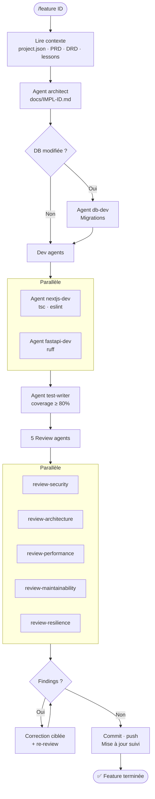

# /feature — Orchestrateur de développement

Reçoit un identifiant de feature. Appelle les agents spécialisés via le tool Agent
pour implémenter, tester et valider. S'arrête quand coverage > 80%, tous les review
agents ont retourné zéro finding critique, et le commit est pushé.

---

## Usage

```
/feature <ID>     ← ID Jira (ARCH-42) ou ID local (RB-01, M1, infra…)
```

---

## Pipeline agents



---

## Protocole d'exécution

### Étape 0 — Lire le contexte

```bash
cat .archipel/project.json
cat docs/PRD.md 2>/dev/null
cat docs/DRD.md 2>/dev/null
grep -B 1 -A 8 "#architecture\|#db" tasks/lessons.md 2>/dev/null || echo "Aucune leçon"
JIRA=$(python3 -c "import json; d=json.load(open('.archipel/project.json')); print(d.get('jira_project',''))" 2>/dev/null)
```

**Mode Jira** (`jira_project` défini) : pull le ticket via MCP Atlassian, passer en "In Progress".
**Mode solo** : lire la description depuis `docs/tasks.md` ou l'argument CLI.

**Archipel Live — enregistrer le projet cible** : si le projet courant n'est pas Archipel lui-même (i.e. si le répertoire du projet est différent de `CLAUDE_PROJECT_DIR`), écrire le chemin absolu du projet cible dans `.archipel/active-build-target` du repo Archipel, pour que les hooks de monitoring redirigent les événements vers le bon feed.

```bash
# Détecter le chemin absolu du projet cible (argument CLI ou pwd)
PROJECT_TARGET="<chemin absolu du projet cible>"
ARCHIPEL_ROOT=$(git -C "${CLAUDE_PROJECT_DIR:-$(pwd)}" rev-parse --show-toplevel 2>/dev/null)
if [ "$PROJECT_TARGET" != "$ARCHIPEL_ROOT" ]; then
  echo "$PROJECT_TARGET" > "$ARCHIPEL_ROOT/.archipel/active-build-target"
  echo "[Archipel Live] Build target : $PROJECT_TARGET"
fi
```

### Étape 1 — Créer la branche

```bash
git checkout -b feat/<id>
```

### Étape 2 — Appeler Agent(architect)

```
tool   : Agent
params :
  subagent_type : "architect"
  prompt        : "
    Feature : <titre + description + critères d'acceptation>

    Contexte projet :
    <contenu de .archipel/project.json>

    PRD : <contenu de docs/PRD.md>
    ADR : <contenu de docs/ADR.md si disponible>
    DRD : <contenu de docs/DRD.md si disponible>

    Lessons (#architecture #db) :
    <entrées filtrées de tasks/lessons.md>

    Produire docs/IMPL-<id>.md et retourner le plan structuré.
    Décisions autonomes — zéro question.
  "
```

**Attendre le résultat.** Lire `docs/IMPL-<id>.md`.

### Étape 3 — Appeler Agent(db-dev) si migrations requises

Si `db_migrations` non vide dans le plan :

```
tool   : Agent
params :
  subagent_type : "db-dev"
  prompt        : "
    Plan : <contenu de docs/IMPL-<id>.md>
    Schémas existants : <schema.prisma et/ou apps/api/models/>
    Appliquer les migrations. Retourner : migration créée, appliquée, index créés.
  "
```

**Attendre la confirmation.**

### Étape 4 — Appeler les agents dev en parallèle

Dans **un seul message**, envoyer les appels Agent simultanément selon la stack :

**Si `nextjs` dans stack :**
```
tool   : Agent
params :
  subagent_type : "nextjs-dev"
  prompt        : "
    Plan : <contenu de docs/IMPL-<id>.md>
    Type projet : <perso|clubmed>
    DRD : <contenu si disponible>
    Implémenter tous les fichiers du plan. Retourner : fichiers créés, tsc OK, eslint OK.
  "
```

**Si `python-api` dans stack (même message, appel simultané) :**
```
tool   : Agent
params :
  subagent_type : "fastapi-dev"
  prompt        : "
    Plan : <contenu de docs/IMPL-<id>.md>
    Implémenter tous les fichiers du plan. Retourner : fichiers créés, ruff OK.
  "
```

**Attendre que les deux aient retourné.**

### Étape 5 — Appeler Agent(test-writer) — obligatoire

```
tool   : Agent
params :
  subagent_type : "test-writer"
  prompt        : "
    Plan : <contenu de docs/IMPL-<id>.md>
    Fichiers implémentés : <liste retournée par les dev agents>
    Critères d'acceptation : <section PRD concernée>
    Écrire tests Jest + pytest. Boucler jusqu'à coverage ≥ 80%.
    Retourner : coverage web, coverage api, tests écrits, tous verts.
  "
```

**Attendre : coverage ≥ 80%, tous les tests verts.**

### Étape 6 — Appeler les 5 agents review en parallèle

Dans **un seul message**, envoyer les 5 appels Agent simultanément :

```
tool : Agent — subagent_type : "review-security"
tool : Agent — subagent_type : "review-architecture"
tool : Agent — subagent_type : "review-performance"
tool : Agent — subagent_type : "review-maintainability"
tool : Agent — subagent_type : "review-resilience"
```

Chacun reçoit :
```
prompt : "
  Analyser les fichiers : <liste des fichiers créés/modifiés>
  Lire chaque fichier et produire le rapport findings.
  Retourner : findings (sévérité, fichier, ligne, correction), statut global.
"
```

**Attendre les 5 rapports.**

### Étape 7 — Boucle de correction

**RÈGLE ABSOLUE : ne jamais éditer le code directement avec Edit/Write dans cette étape.**
Toute correction passe par un appel Agent. L'orchestrateur coordonne, les agents corrigent.

```
TANT QUE (findings critiques > 0 OU findings majeurs > 0) :

  Pour chaque finding critique ou majeur :

    1. Identifier : fichier .py → fastapi-dev, fichier .tsx/.ts → nextjs-dev

    2. Appeler le tool Agent — correction :
       subagent_type : "fastapi-dev" OU "nextjs-dev"
       prompt : "
         Corriger ce finding précis :
         Sévérité : <critique|majeur>
         Fichier : <chemin exact>
         Ligne : <numéro>
         Problème : <description exacte>
         Fix attendu : <correction suggérée par le review agent>
         Correction minimale uniquement — ne pas refactorer au-delà du finding.
       "
       Attendre le résultat.

    3. Appeler le tool Agent — re-review ciblé :
       subagent_type : "<agent review source du finding>"
       prompt : "Re-auditer <fichier> après correction du finding : <description>"
       Attendre le résultat.

    4. Si non résolu après 3 tentatives → BLOQUER

  Si correction → appeler Agent(test-writer) pour vérifier le coverage

FIN TANT QUE

Si boucle > 1 itération → écrire dans tasks/lessons.md via Bash.
```

### Étape 8 — Commit et push

```bash
git add <fichiers explicites — jamais git add .>
git commit -m "feat(<scope>): <description> [<ID>]"
git push origin feat/<id>
```

### Étape 9 — Mise à jour du suivi

**Mode Jira :** passer en "In Review" via MCP Atlassian + commentaire fichiers modifiés.
**Mode solo :** cocher dans `docs/tasks.md`.

**Archipel Live — nettoyer le build target** :

```bash
ARCHIPEL_ROOT=$(git -C "${CLAUDE_PROJECT_DIR:-$(pwd)}" rev-parse --show-toplevel 2>/dev/null)
rm -f "$ARCHIPEL_ROOT/.archipel/active-build-target"
echo "[Archipel Live] Build target effacé"
```

---

## Critère de sortie

- `docs/IMPL-<id>.md` produit
- Code implémenté (tsc OK + ruff OK + lint OK)
- Coverage ≥ 80%
- Zéro finding critique ou majeur
- Commit pushé sur `feat/<id>`
- Ticket/tâche mis à jour
