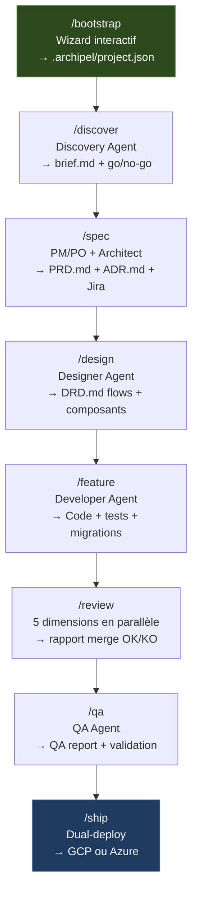
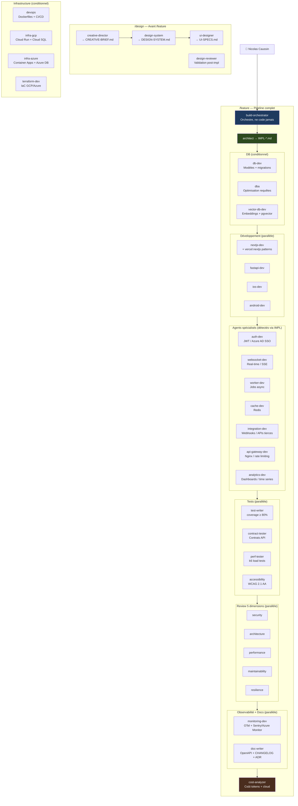
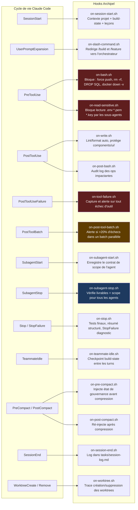
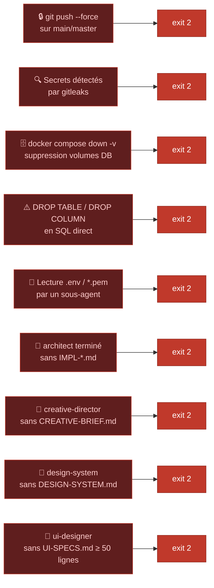
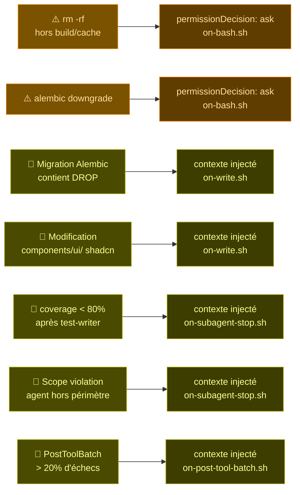
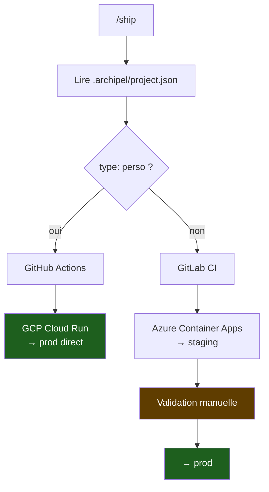
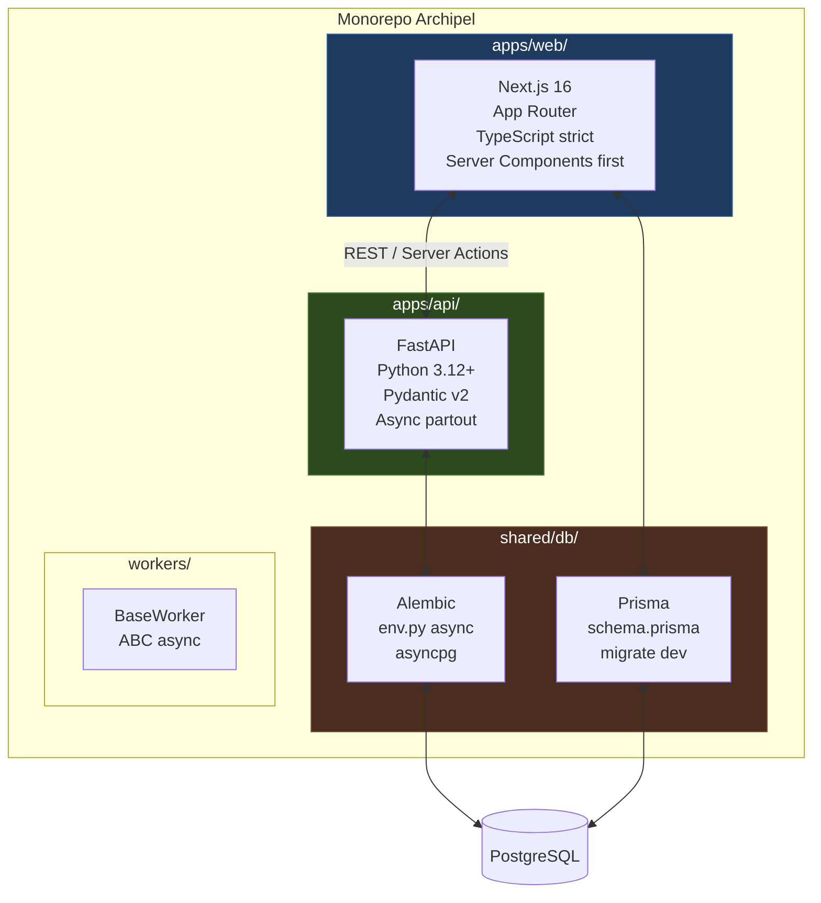
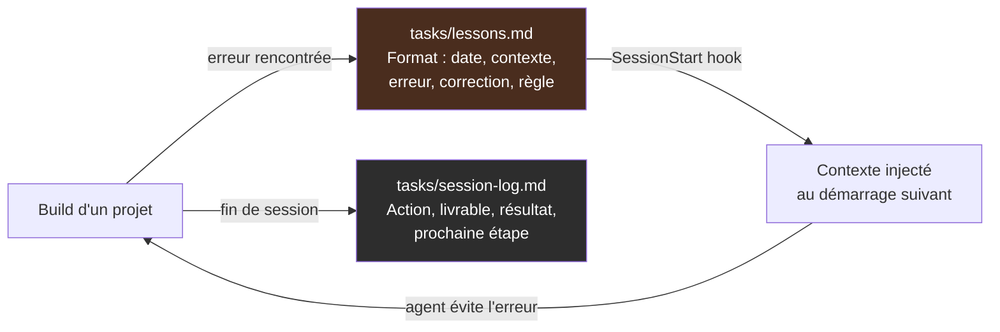

# Archipel — Software Factory

> Pipeline de développement AI-first pour side projects personnels et projets Club Med.
> Orchestré par Claude Code — zéro revue humaine entre les étapes.

---

## Archipel Live — Dashboard temps réel

Visualise en direct le pipeline, les agents, les hooks et les événements de chaque projet.


```bash
npm run monitor          # serveur SSE → http://localhost:3999
cd apps/web && npm run dev   # dashboard  → http://localhost:3998/monitor
```

Mode démo (sans monitor) : `http://localhost:3998/monitor?demo=true`

→ **[Documentation complète](tools/README.md)**

---

## Vue d'ensemble

Archipel est une **factory**, pas une application. Elle génère des projets complets (Next.js + FastAPI + PostgreSQL) via un pipeline d'agents IA spécialisés, gouvernés par des hooks déterministes.


---

## Pipeline



| Commande | Agent | Livrable | Mode |
|---|---|---|---|
| `/bootstrap` | — | `.archipel/project.json` | Wizard interactif |
| `/adopt` | — | `project.json` + adoption-plan | Rétro-analyse |
| `/modernize` | Modernization Agent | Projet V2 from scratch | Human-AI collab |
| `/discover` | Discovery Agent | `brief.md` + go/no-go | Human+AI |
| `/spec` | PM/PO + Architect | `PRD.md` + `ADR.md` + Jira | Human-AI collab |
| `/design` | Designer Agent | `DRD.md` (flows + composants) | Human-AI collab |
| `/feature` | Developer Agent | Code + tests + migrations | AI-led |
| `/review` | Reviewer Orchestrator | Rapport 5 dimensions | Human-AI collab |
| `/qa` | QA Agent | QA report + validation | AI-led + Human |
| `/ship` | — | Deploy prod | AI-led |

---

## Architecture des agents

38 agents spécialisés organisés en 10 couches. Le `build-orchestrator` les invoque dans l'ordre selon le contenu du plan `IMPL-*.md` — jamais en dur, toujours par détection contextuelle.



### Catalogue complet — 38 agents

#### Orchestration
| Agent | Rôle |
|---|---|
| `build-orchestrator` | Orchestre l'intégralité du build. Ne touche jamais au code. Délègue tout. |
| `architect` | Produit `docs/IMPL-*.md` — le plan technique consommé par tous les agents dev. |

#### Design
| Agent | Rôle | Déclenchement |
|---|---|---|
| `creative-director` | Direction visuelle, palette, typographie → `CREATIVE-BRIEF.md` | Si CREATIVE-BRIEF absent |
| `design-system` | Tokens Tailwind, globals.css, composants métier → `DESIGN-SYSTEM.md` | Si DESIGN-SYSTEM absent |
| `ui-designer` | Specs de composants ultra-précises, layout ASCII → `UI-SPECS.md` | Si UI-SPECS absent |
| `design-reviewer` | Vérifie que le code frontend correspond aux specs pixel-perfect | Après nextjs-dev |

#### Frontend
| Agent | Rôle | Déclenchement |
|---|---|---|
| `nextjs-dev` | Next.js 16 App Router, Server Components, Server Actions. Applique les patterns officiels Vercel via `vercel:nextjs`. | Stack nextjs |
| `ios-dev` | Swift 5.9+ / SwiftUI / URLSession / MSAL Azure AD pour clubmed | Stack ios/swift |
| `android-dev` | Kotlin / Jetpack Compose / Retrofit / MSAL Android pour clubmed | Stack android/kotlin |
| `accessibility` | Audit WCAG 2.1 AA : ARIA, contraste, navigation clavier, VoiceOver | Après nextjs-dev si composants UI |

#### Backend
| Agent | Rôle | Déclenchement |
|---|---|---|
| `fastapi-dev` | Routers → Services → Repositories. Async partout, Pydantic v2, ruff clean. | Stack fastapi |
| `auth-dev` | OAuth2, JWT, RBAC. Azure AD SSO (clubmed) / PyJWT (perso). Middleware FastAPI + next-auth. | Mots-clés : auth, login, JWT, SSO, RBAC |
| `websocket-dev` | WebSocket FastAPI, ConnectionManager, broadcast, SSE. Reconnexion React avec backoff. | Mots-clés : websocket, real-time, SSE |
| `worker-dev` | Workers async héritant de `BaseWorker`. Redis BLPOP, DLQ, stateless + idempotent. | Mots-clés : worker, queue, async job |
| `cache-dev` | Redis async, cache-aside, stampede protection, `revalidateTag` Next.js. | Mots-clés : cache, Redis, revalidate |
| `integration-dev` | Webhooks HMAC, idempotency keys, retry avec backoff, circuit breaker. | Mots-clés : webhook, external API |
| `api-gateway-dev` | Nginx rate limiting, Traefik labels, middlewares FastAPI (RequestID, CORS, logging). | Mots-clés : rate limiting, nginx, gateway |

#### Data
| Agent | Rôle | Déclenchement |
|---|---|---|
| `db-dev` | Modèles SQLAlchemy, migrations Alembic async, schéma Prisma, index dès la création. | Si schéma DB dans IMPL |
| `dba` | Optimisation PostgreSQL : EXPLAIN ANALYZE, index CONCURRENTLY, détection N+1. | Après db-dev si jointures complexes |
| `vector-db-dev` | pgvector : colonnes `vector(1536)`, index HNSW/IVFFlat, RAG patterns, embeddings batch. | Mots-clés : embedding, vector, pgvector |
| `analytics-dev` | CTEs, window functions, time series, requêtes Recharts-ready. | Mots-clés : analytics, dashboard, time series |

#### Infrastructure
| Agent | Rôle | Déclenchement |
|---|---|---|
| `devops` | Dockerfiles multi-stage (non-root, healthcheck), docker-compose, CI/CD pipelines. | Si Dockerfile ou docker-compose absent |
| `infra-gcp` | Cloud Run, Cloud SQL, Artifact Registry, Workload Identity. Region `europe-west1`. | `type: perso` + demande cloud |
| `infra-azure` | Container Apps, Azure DB for PG, Key Vault, Managed Identity, Federated Credentials. | `type: clubmed` + demande cloud |
| `terraform-dev` | IaC GCP ou Azure depuis `.archipel/config/`. State distant (GCS/Azure Storage). | Si IaC requis |

#### Tests & Qualité
| Agent | Rôle | Déclenchement |
|---|---|---|
| `test-writer` | Jest + pytest, coverage ≥ 80%, fixtures PostgreSQL réelles (pas SQLite). | Après chaque milestone |
| `e2e-validator` | Smoke tests Playwright sur l'URL déployée. PASS/FAIL + screenshots. | Étape 4 — validation finale |
| `perf-tester` | k6 : smoke / average load / stress / spike. Seuils p95 < 500ms. | Endpoints à fort volume |
| `contract-tester` | schemathesis + openapi-typescript. Détecte les breaking changes API. | Après test-writer |

#### Review (5 dimensions)
| Agent | Rôle |
|---|---|
| `review-security` | Secrets, injections SQL/XSS, auth manquante, CORS, PII dans les logs |
| `review-architecture` | SoC, Repository pattern, typage TypeScript/Pydantic, Server Components |
| `review-performance` | N+1, pagination manquante, index absents, await séquentiel |
| `review-maintainability` | Fonctions trop longues, nommage obscur, duplication |
| `review-resilience` | Gestion d'erreurs, timeouts APIs tierces, cas limites, états UI vides |

#### Observabilité & Documentation
| Agent | Rôle | Déclenchement |
|---|---|---|
| `monitoring-dev` | OpenTelemetry : traces FastAPI + Next.js. Sentry (perso) ou Azure Monitor (clubmed). `/health` enrichi. | Une fois, post-milestones |
| `doc-writer` | OpenAPI enrichi (descriptions, exemples), CHANGELOG Keep a Changelog, ADR Markdown. | Après monitoring-dev |

#### Intelligence
| Agent | Rôle | Déclenchement |
|---|---|---|
| `kaizen` | Analyse les builds terminés, détecte les patterns d'amélioration. Observation uniquement. | Après build stable |
| `cost-analyzer` | Coût tokens Claude (cache/input/output), coût cloud GCP/Azure estimé par build. | Fin de chaque build |

---

## Gouvernance — Hooks Claude Code

Les hooks sont exécutés par le **harness Claude Code**, pas par Claude. Ils sont **déterministes à 100%** — aucun agent ne peut les contourner.



### Gates bloquants — `exit 2`, opération annulée



### Avertissements — confirmation ou contexte injecté



---

## Dual-deploy



| Config | perso | clubmed |
|---|---|---|
| Git remote | GitHub | GitLab |
| CI/CD | GitHub Actions | GitLab CI |
| Cloud | GCP | Azure |
| Strategy | Direct → prod | Staging → validation → prod |
| PostgreSQL | Cloud SQL | Azure Database for PG |

---

## Stack générée



---

## Self-improvement

Archipel apprend de ses erreurs. Chaque build alimente un journal de leçons réinjecté au démarrage de chaque session.



---

## Structure du repo

```
archipel/
├── .archipel/
│   ├── project.json          # Config projet actif (généré par /bootstrap)
│   ├── config/
│   │   ├── gcp.yml           # Template deploy perso
│   │   └── azure.yml         # Template deploy clubmed
│   └── templates/            # Templates réutilisables (Trident, etc.)
├── .claude/
│   ├── agents/               # 38 agents spécialisés
│   ├── commands/             # Slash commands (/spec, /feature, /ship…)
│   ├── hooks/                # 16 scripts de gouvernance
│   └── settings.json         # Mapping events → hooks
├── apps/
│   ├── api/                  # FastAPI scaffold
│   └── web/                  # Next.js scaffold
├── ci/
│   ├── github-actions/       # Pipeline perso
│   └── gitlab-ci/            # Pipeline clubmed
├── shared/db/
│   ├── alembic/              # Migrations Python
│   └── prisma/               # Schema + migrations TS
├── skills/                   # Conventions par domaine
├── tasks/
│   ├── lessons.md            # Journal d'apprentissage
│   └── session-log.md        # Log des sessions
└── workers/                  # Jobs async Python
```

---

## Démarrage rapide

```bash
# 1. Cloner la factory
git clone https://github.com/Nicolas78240/archipel
cd archipel

# 2. Bootstrapper un nouveau projet
# Dans Claude Code :
/bootstrap

# 3. Lancer le pipeline
/discover       # Valider l'idée
/spec           # PRD + tickets Jira
/design         # Flows + composants
/feature        # Code complet
/review         # Audit 5 dimensions
/qa             # Validation finale
/ship           # Deploy
```

---

## Qualité

Audit `2026-05-31` — **8,3 / 10**

| Dimension | Score |
|---|---|
| Sécurité | 9,5/10 — 0 secret, 0 CVE, trivy propre |
| Tests | 8,5/10 — coverage API 91% |
| Architecture | 9,0/10 — stack async cohérente |
| CI/CD | 9,0/10 — gitleaks + coverage enforced |
| Maintenabilité | 9,0/10 — CLAUDE.md 147 lignes, hooks documentés |

---

*Archipel — forge de Nicolas Caussin*
