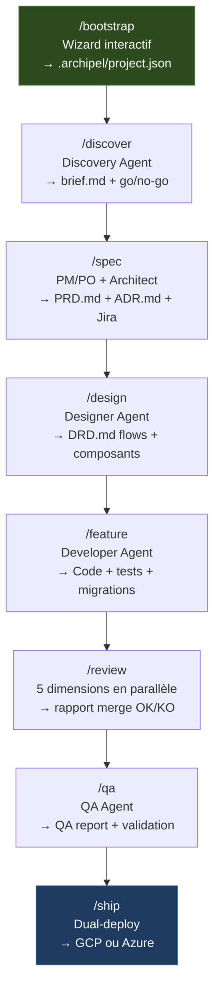
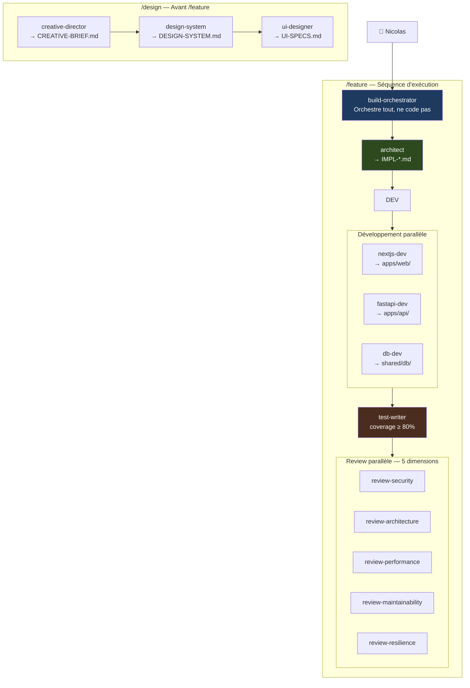
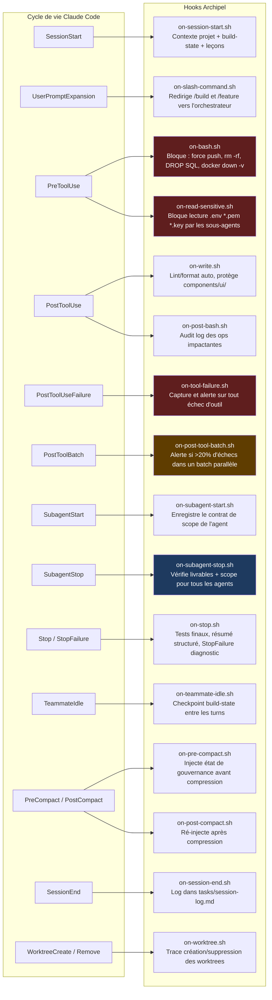
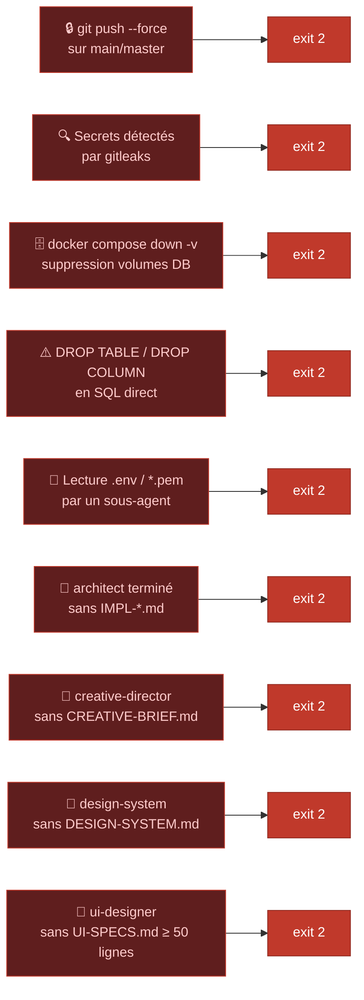
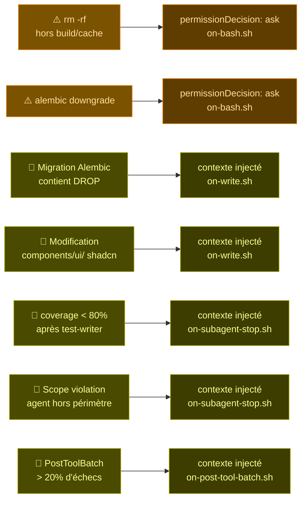
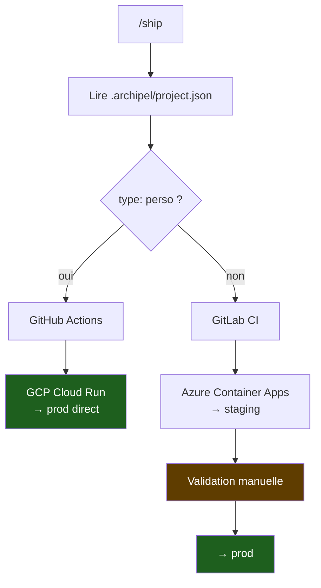
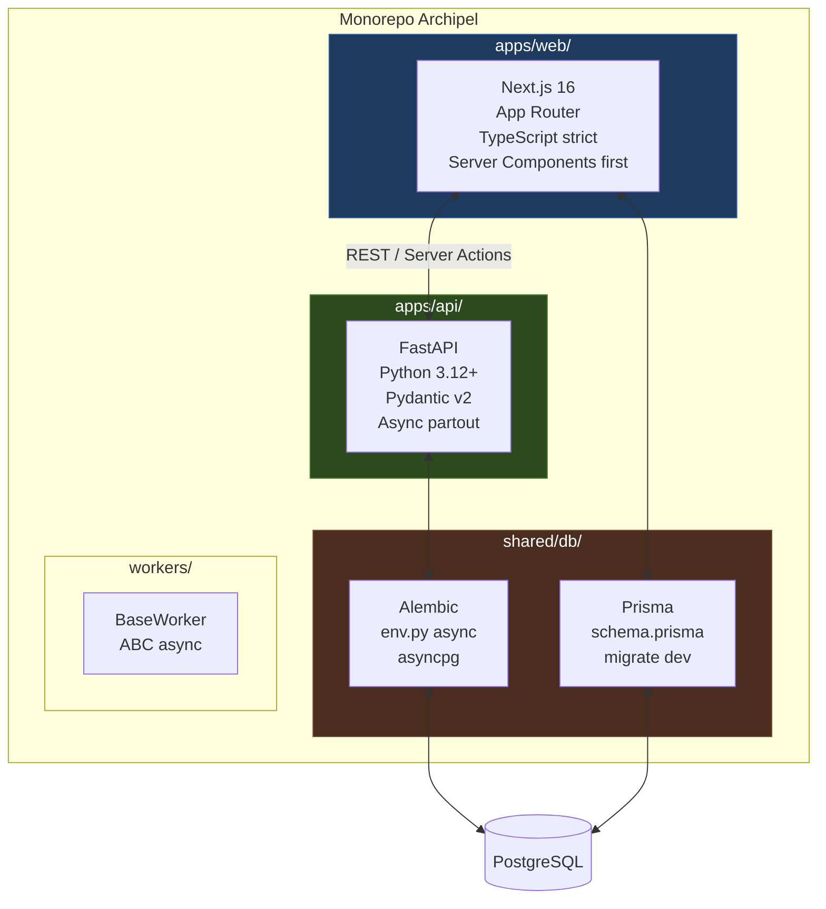
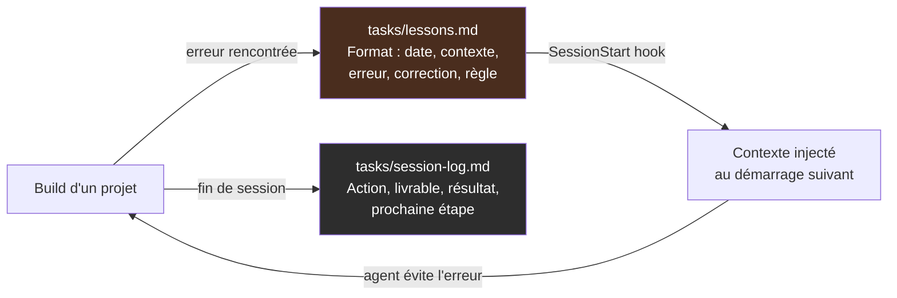

# Archipel — Software Factory

> Pipeline de développement AI-first pour side projects personnels et projets Club Med.
> Orchestré par Claude Code — zéro revue humaine entre les étapes.

---

## Vue d'ensemble

Archipel est une **factory**, pas une application. Elle génère des projets complets (Next.js + FastAPI + PostgreSQL) via un pipeline d'agents IA spécialisés, gouvernés par des hooks déterministes.


---

## Pipeline



| Commande | Agent | Livrable | Mode |
|---|---|---|---|
| `/bootstrap` | — | `.archipel/project.json` | Wizard interactif |
| `/adopt` | — | `project.json` + adoption-plan | Rétro-analyse |
| `/modernize` | Modernization Agent | Projet V2 from scratch | Human-AI collab |
| `/discover` | Discovery Agent | `brief.md` + go/no-go | Human+AI |
| `/spec` | PM/PO + Architect | `PRD.md` + `ADR.md` + Jira | Human-AI collab |
| `/design` | Designer Agent | `DRD.md` (flows + composants) | Human-AI collab |
| `/feature` | Developer Agent | Code + tests + migrations | AI-led |
| `/review` | Reviewer Orchestrator | Rapport 5 dimensions | Human-AI collab |
| `/qa` | QA Agent | QA report + validation | AI-led + Human |
| `/ship` | — | Deploy prod | AI-led |

---

## Architecture des agents



---

## Gouvernance — Hooks Claude Code

Les hooks sont exécutés par le **harness Claude Code**, pas par Claude. Ils sont **déterministes à 100%** — aucun agent ne peut les contourner.



### Gates bloquants — `exit 2`, opération annulée



### Avertissements — confirmation ou contexte injecté



---

## Dual-deploy



| Config | perso | clubmed |
|---|---|---|
| Git remote | GitHub | GitLab |
| CI/CD | GitHub Actions | GitLab CI |
| Cloud | GCP | Azure |
| Strategy | Direct → prod | Staging → validation → prod |
| PostgreSQL | Cloud SQL | Azure Database for PG |

---

## Stack générée



---

## Self-improvement

Archipel apprend de ses erreurs. Chaque build alimente un journal de leçons réinjecté au démarrage de chaque session.



---

## Structure du repo

```
archipel/
├── .archipel/
│   ├── project.json          # Config projet actif (généré par /bootstrap)
│   ├── config/
│   │   ├── gcp.yml           # Template deploy perso
│   │   └── azure.yml         # Template deploy clubmed
│   └── templates/            # Templates réutilisables (Trident, etc.)
├── .claude/
│   ├── agents/               # 17 agents spécialisés
│   ├── commands/             # Slash commands (/spec, /feature, /ship…)
│   ├── hooks/                # 16 scripts de gouvernance
│   └── settings.json         # Mapping events → hooks
├── apps/
│   ├── api/                  # FastAPI scaffold
│   └── web/                  # Next.js scaffold
├── ci/
│   ├── github-actions/       # Pipeline perso
│   └── gitlab-ci/            # Pipeline clubmed
├── shared/db/
│   ├── alembic/              # Migrations Python
│   └── prisma/               # Schema + migrations TS
├── skills/                   # Conventions par domaine
├── tasks/
│   ├── lessons.md            # Journal d'apprentissage
│   └── session-log.md        # Log des sessions
└── workers/                  # Jobs async Python
```

---

## Démarrage rapide

```bash
# 1. Cloner la factory
git clone https://github.com/Nicolas78240/archipel
cd archipel

# 2. Bootstrapper un nouveau projet
# Dans Claude Code :
/bootstrap

# 3. Lancer le pipeline
/discover       # Valider l'idée
/spec           # PRD + tickets Jira
/design         # Flows + composants
/feature        # Code complet
/review         # Audit 5 dimensions
/qa             # Validation finale
/ship           # Deploy
```

---

## Qualité

Audit `2026-05-31` — **8,3 / 10**

| Dimension | Score |
|---|---|
| Sécurité | 9,5/10 — 0 secret, 0 CVE, trivy propre |
| Tests | 8,5/10 — coverage API 91% |
| Architecture | 9,0/10 — stack async cohérente |
| CI/CD | 9,0/10 — gitleaks + coverage enforced |
| Maintenabilité | 9,0/10 — CLAUDE.md 147 lignes, hooks documentés |

---

*Archipel — forge de Nicolas Caussin*
