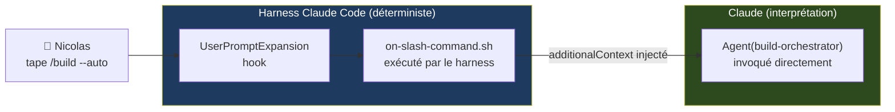
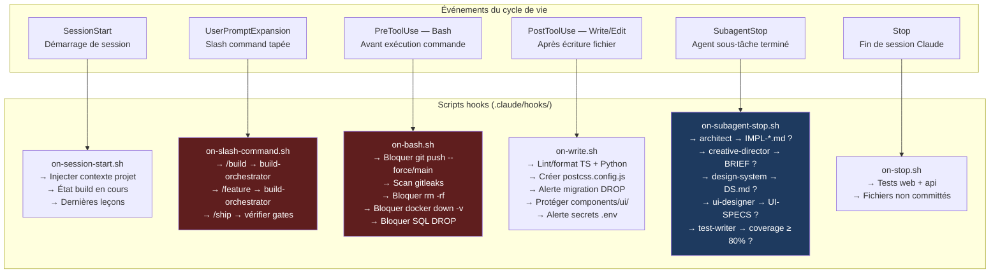
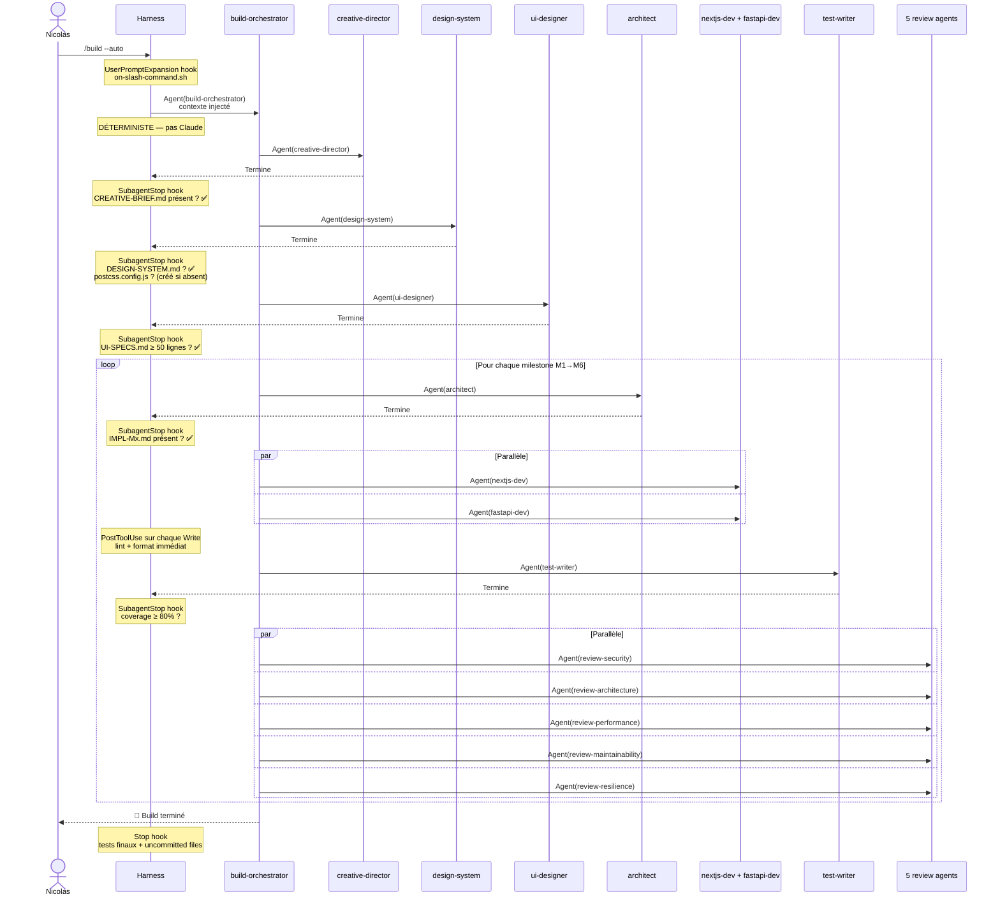
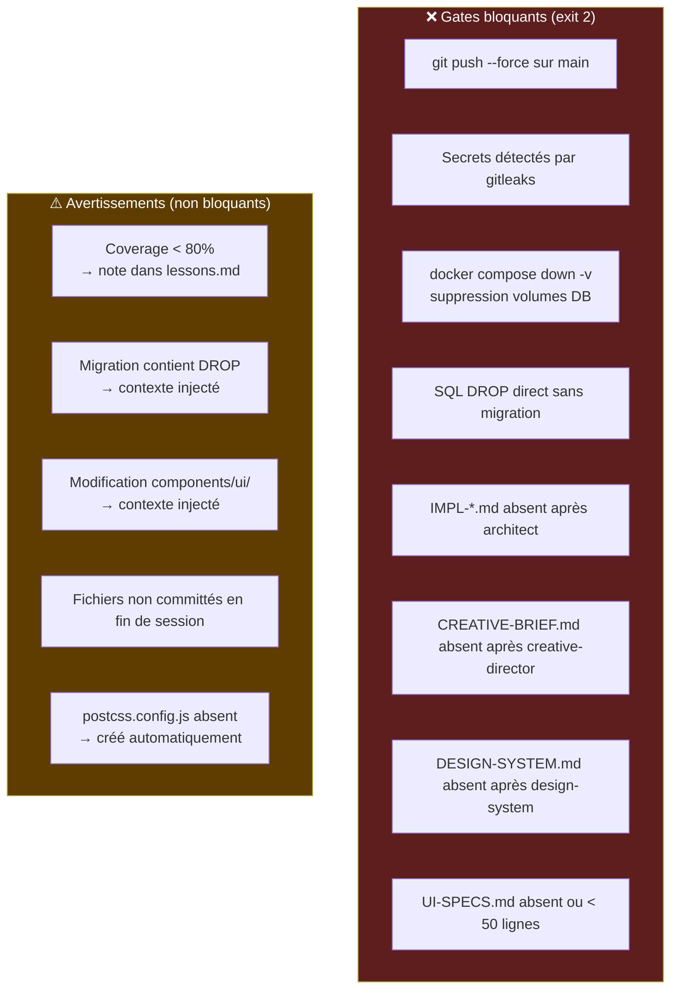
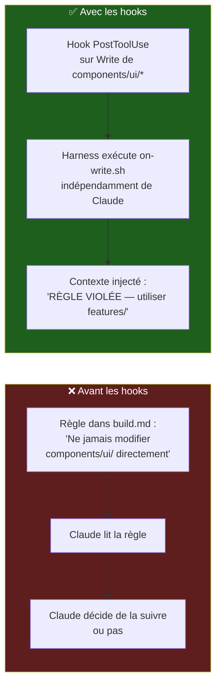

# Architecture des Hooks — Archipel Software Factory

Les hooks sont des scripts shell exécutés **par le harness Claude Code**, pas par Claude.
C'est la différence fondamentale : ils sont **déterministes à 100%** — Claude ne peut pas les contourner.

---

## Principe fondamental



**Sans hook :** Claude lit `/build`, interprète les instructions, les exécute lui-même.
**Avec hook :** Le harness intercepte `/build`, injecte le contexte, Claude voit "invoque Agent(build-orchestrator)" comme instruction prioritaire.

---

## Les 6 hooks d'Archipel



---

## Flux complet d'un `/build --auto`



---

## Gates bloquants vs avertissements



---

## Pourquoi les hooks, pas les instructions textuelles ?



**La différence :**
- Règle textuelle → Claude l'interprète → peut être contournée
- Hook → exécuté par le harness → **jamais contournable**

---

## Structure des fichiers

```
.claude/
  settings.json          ← Configuration des 6 hooks
  hooks/
    on-session-start.sh  ← SessionStart
    on-slash-command.sh  ← UserPromptExpansion (/build, /feature, /ship)
    on-bash.sh           ← PreToolUse Bash (commandes dangereuses)
    on-write.sh          ← PostToolUse Write|Edit (lint, sécurité, design)
    on-subagent-stop.sh  ← SubagentStop (gates livrables agents)
    on-stop.sh           ← Stop (tests finaux, uncommitted)
```
