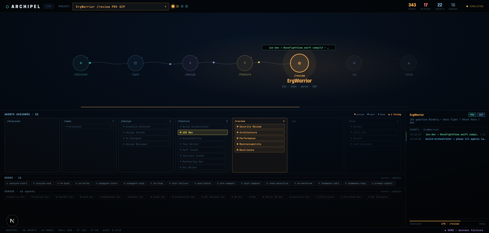
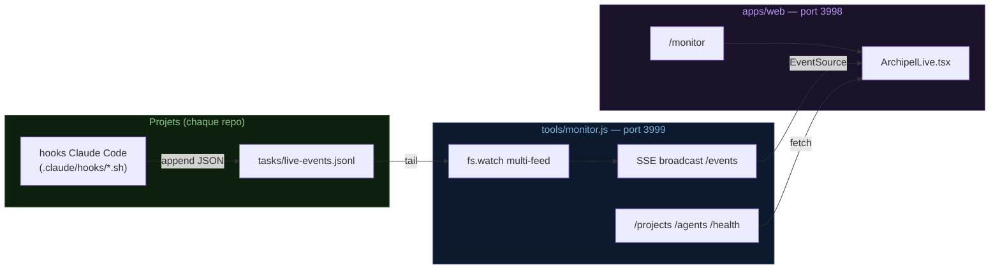
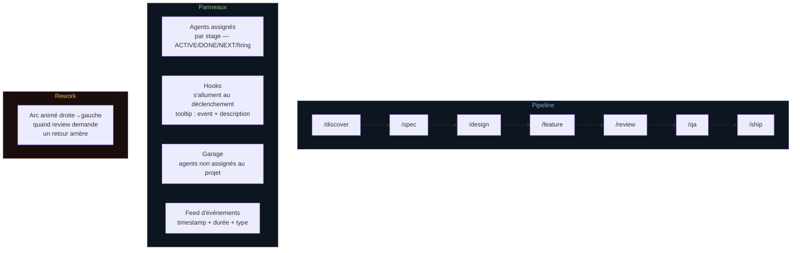

# Archipel Live

Dashboard temps réel de la Software Factory Archipel — visualise en direct le pipeline, les agents, les hooks et les événements de chaque projet.



---

## Architecture



---

## Lancer

```bash
# Terminal 1 — serveur SSE
npm run monitor          # http://localhost:3999

# Terminal 2 — dashboard Next.js
cd apps/web && npm run dev   # http://localhost:3998/monitor
```

## Modes

| URL | Comportement |
|-----|-------------|
| `/monitor` | Projets réels — connexion SSE live au monitor |
| `/monitor?demo=true` | Simulation avec projets fictifs — cycle complet /discover→/ship automatique |

---

## Ce que visualise le dashboard



---

## Endpoints monitor (port 3999)

| Route | Description |
|-------|-------------|
| `GET /events` | SSE — stream des événements de tous les feeds |
| `GET /projects` | Liste des projets + agents détectés + feedExists |
| `GET /agents` | Agents dans `.claude/agents/` du repo Archipel |
| `GET /health` | Status JSON (clients, projets, feeds watchés, uptime) |
| `GET /push?json=...` | Injection debug d'un événement |

---

## Projets enregistrés

Définis dans `.archipel/projects.json`. Chaque projet bootstrappé avec `/bootstrap` est automatiquement ajouté.

```json
{
  "projects": [
    { "name": "GentilGantt",    "path": "/Users/caussni/Dev/GentilGantt",    "type": "clubmed", "cloud": "Azure" },
    { "name": "assistant",      "path": "/Users/caussni/Dev/assistant",      "type": "perso",   "cloud": "GCP"   },
    { "name": "gMDTPlanningv2", "path": "/Users/caussni/Dev/gMDTPlanningv2", "type": "clubmed", "cloud": "Azure" }
  ]
}
```

Le monitor lit aussi automatiquement le repo Archipel lui-même depuis `.archipel/project.json`.

---

## Format des événements (`tasks/live-events.jsonl`)

```json
{ "ts": "14:32:07", "hook": "on-bash",  "type": "ok",      "project": "GentilGantt", "msg": "git push → gitleaks OK" }
{ "ts": "14:32:09", "hook": "on-write", "type": "write",   "project": "GentilGantt", "msg": "eslint Gantt.tsx" }
{ "ts": "14:32:11", "hook": "on-stop",  "type": "blocked", "project": "GentilGantt", "msg": "coverage 71% < 80%" }
{ "ts": "14:32:14", "hook": "on-subagent-stop", "type": "blocked", "agent": "review-security",
  "rework": { "from": "review", "to": "feature" }, "msg": "PII dans logs → REWORK" }
```

| Champ | Valeurs |
|-------|---------|
| `type` | `ok` `blocked` `warn` `info` `agent` `write` `success` |
| `hook` | identifiant du hook déclencheur |
| `agent` | id de l'agent si applicable |
| `rework` | `{ "from": "review", "to": "feature" }` si rework détecté |
